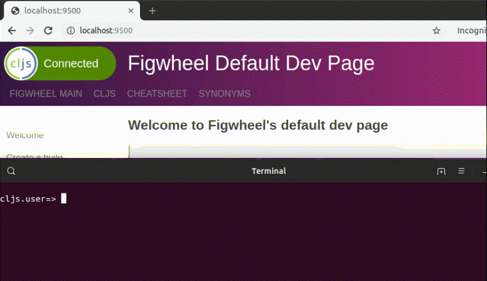

# suitable - ClojureScript Completion Toolkit

[](https://circleci.com/gh/clojure-emacs/clj-suitable/tree/master)
[](https://clojars.org/org.rksm/suitable)
[](https://cljdoc.org/d/org.rksm/suitable/CURRENT)
[](https://clojars.org/org.rksm/suitable)

`suitable` provides static and dynamic code completion for ClojureScript tools.

It provides two complementary completion sources:

- It integrates with the CLJS analyzer and using the compilation state for "static" symbol completion. This functionality was briefly part of [compliment](https://github.com/alexander-yakushev/compliment), and before this - [Orchard](https://github.com/clojure-emacs/orchard) and [cljs-tooling](https://github.com/clojure-emacs/cljs-tooling).
- It can use a CLJS REPL session to query and inspect JavaScript runtime state, allowing code completion for JavaScript objects and interfaces.

## Static code completion

The static code completion is based on analysis of the ClojureScript compiler state. This approach was pioneered by `cljs-tooling` and the completion logic was subsequently moved to `orchard`, `compliment` and finally here.

Why here? Because it's very convenient from the user perspective to have a single library providing both types of completion.

This type of completion provides a [compliment custom source](https://github.com/alexander-yakushev/compliment/wiki/Custom-sources) for ClojureScript, so it's easy to plug with the most popular completion framework out there.

``` clojure
(ns suitable.demo
  (:require
   [compliment.core :as complete]
   [suitable.compliment.sources.cljs :as suitable-sources]))

(def cljs-sources
  "A list of ClojureScript completion sources for compliment."
  [::suitable-sources/cljs-source])

;; you can obtain the ClojureScript environment in many different ways
;; we'll leave the details to you
(binding [suitable-sources/*compiler-env* cljs-env]
  (complete/completions prefix (merge completion-opts {:sources cljs-sources})))
```

Note that you'll need to establish a binding to `suitable-sources/*compiler-env*` for the completion to work.

## Dynamic code completion for CLJS repls

The dynamic code completion features allow for exploratory development by inspecting the runtime. For example you work with DOM objects but can't remember how to query for child elements. Type `(.| js/document)` (with `|` marking the postion of your cursor) and press TAB. Methods and properties of `js/document` will appear — including `querySelector` and `querySelectorAll`.

### Beware the Side-Effects

The dynamic code completion *evaluates* code on completion requests! It does this by trying to [enumerate the properties](https://developer.mozilla.org/en-US/docs/Web/JavaScript/Reference/Global_Objects/Object/getOwnPropertyDescriptors) of JavaScript objects, so in the example above it would fetch all properties of the `js/document` object. This might cause side effects: Even just reading property values of an object can run arbitrary code if that object defines getter functions.

Moreover, also chains of methods and properties will be evaluated upon completion requests. So for example, asking for completions for the code / cursor position `(-> js/some-object (.deleteAllMyFilesAndStartAWar) .|)` will evaluate the JavaScript code `some-object.deleteAllMyFilesAndStartAWar()`! This only applies to JavaSript interop code, i.e. JavaScript methods and properties. Pure ClojureScript is not inspected or evaluated. Please be aware of this behavior when using the dynamic code completion features.

### Dynamic completion Demo

The animation shows how various properties and methods of the native DOM can be accessed (Tab is used to show completions for the expression at the cursor):



## Setup

### figwheel.main with rebel-readline

Please note that you need to use [rebel-readline](https://github.com/bhauman/rebel-readline) with figwheel for that to work. Plain repls have no completion feature.

#### Tools CLI

First make sure that the [normal Tools CLI setup](https://figwheel.org/#setting-up-a-build-with-tools-cli) works.

Then modify `deps.edn` and `dev.cljs.edn`, you should end up with the files looking like below:

- `deps.edn`

```clojure
{:deps {com.bhauman/figwheel-main {:mvn/version "RELEASE"}
        com.bhauman/rebel-readline-cljs {:mvn/version "RELEASE"}}
 :paths ["src" "target" "resources"]
 :aliases {:build-dev {:main-opts ["-m" "figwheel.main" "-b" "dev" "-r"]}
           :suitable {:extra-deps {org.rksm/suitable {:mvn/version "RELEASE"}}
	              :main-opts ["-e" "(require,'suitable.hijack-rebel-readline-complete)"
                                  "-m" "figwheel.main"
                                  "--build" "dev" "--repl"]}}}
```

- `dev.cljs.edn`

```clojure
{:main example.core
 :preloads [suitable.js-introspection]}
```

- `src/example/core.cljs`

```clojure
(ns example.core)
```

You can now start a figwheel repl via `clj -M:suitable` and use TAB to complete.

#### leiningen

First make sure that the [normal leiningen setup](https://figwheel.org/#setting-up-a-build-with-leiningen) works.

Add `[org.rksm/suitable "0.4.0"]` to your dependencies vector.

Then you can start a repl with `lein trampoline run -m suitable.figwheel.main -- -b dev -r`

### Emacs CIDER

Suitable is used by CIDER's code completion middleware (as of CIDER 0.22.0), so no extra installation steps are required.

CIDER will always use the static code completion provided by suitable, regardless of the ClojureScript runtime, but the dynamic completion is **not** currently available with `shadow-cljs`. (See [this ticket](https://github.com/clojure-emacs/clj-suitable/issues/15) for more details)

In case you run into any issues with suitable's dynamic completion in CIDER you can disable it like this:

``` emacs-lisp
(setq cider-enhanced-cljs-completion-p nil)
```

You'll still be using suitable this way, but only its static completion mechanism.

### VS Code Calva

Everything in the section above applies when using Calva.

The `calva.enableJSCompletions` setting controls dynamic completion, and it is enabled by default.

### Custom nREPL server

To load suitable into a custom server you can load it using this monstrosity:

```shell
clj -Sdeps '{:deps {cider/cider-nrepl {:mvn/version "RELEASE"} cider/piggieback {:mvn/version "RELEASE"}}}' -m nrepl.cmdline --middleware "[cider.nrepl/cider-middleware,cider.piggieback/wrap-cljs-repl]"
```

Or from within Clojure:

```clojure
(ns my-own-nrepl-server
  (:require cider.nrepl
            cider.piggieback
            nrepl.server))

(defn start-cljs-nrepl-server []
(let [middlewares (conj (map resolve cider.nrepl/cider-middleware)
                        #'cider.piggieback/wrap-cljs-repl)
      handler (apply nrepl.server/default-handler middlewares)]
  (nrepl.server/start-server :handler handler))
```

**Note:** Make sure to use the latest version of `cider-nrepl` and `piggieback`.

### shadow-cljs + cider

Please see [issue #2](https://github.com/clojure-emacs/clj-suitable/issues/2#issuecomment-578447046).

## How does it work?

suitable uses the same input as the widely used
[compliment](https://github.com/alexander-yakushev/compliment). This means it gets a prefix string and a context form from the tool it is connected to. For example you type `(.l| js/console)` with "|" marking where your cursor is. The input we get would then be: prefix = `.l` and context = `(__prefix__ js/console)`.

suitable recognizes various ways how CLJS can access properties and methods, such as `.`, `..`, `doto`, and threading forms. Also direct global access is supported such as `js/console.log`. suitable will then figure out the expression that defines the "parent object" that the property / method we want to use belongs to. For the example above it would be `js/console`. The system then uses the [EcmaScript property descriptor API](https://developer.mozilla.org/en-US/docs/Web/JavaScript/Reference/Global_Objects/Object/defineProperty) to enumerate the object members. Those are converted into completion candidates and send back to the tooling.

## License

This project is [MIT licensed](LICENSE).
